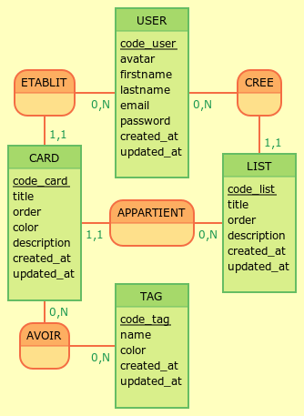
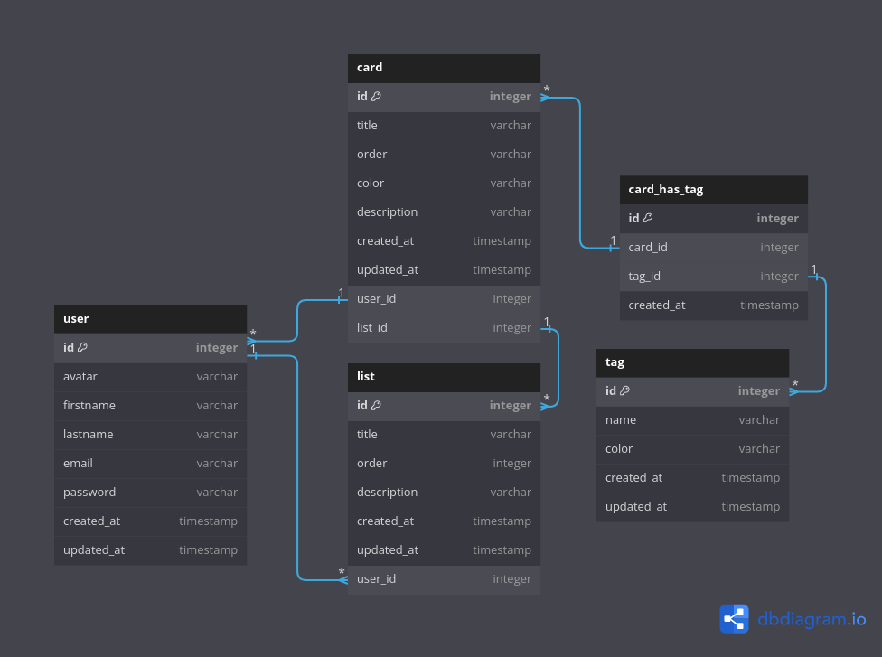

# Conception du projet Kanboard

## Conception Base de Données (MCD, MLD, MPD)

### Etablissement du Modèle Conceptuel de Données sur [Mocodo](http://mocodo.wingi.net/)

```
ETABLIT, 0N USER, 11 CARD
USER: code_user, avatar, firstname, lastname, email, password, created_at, updated_at,
CREE, 0N USER, 11 LIST

CARD: code_card, title, order, color, description, created_at, updated_at,
APPARTIENT, 0N LIST, 11 CARD
LIST: code_list, title, order, description, created_at, updated_at,

AVOIR, 0N CARD, 0N TAG
TAG: code_tag, name, color, created_at, updated_at,
:
```

Visulation :



## Modèle Logique de Données

```
USER (code_user, title, order, color, created_at, updated_at)
LIST  (code_list, title, order, description, created_at, updated_at, #code_user)
CARD (code_card, title, order, color, description, created_at, updated_at, #code_user, #code_list)
AVOIR (#code_card, #code_tag)
TAG ( code_tag, name, color, created_at, updated_at )
```

## Modèle Physique de Données


